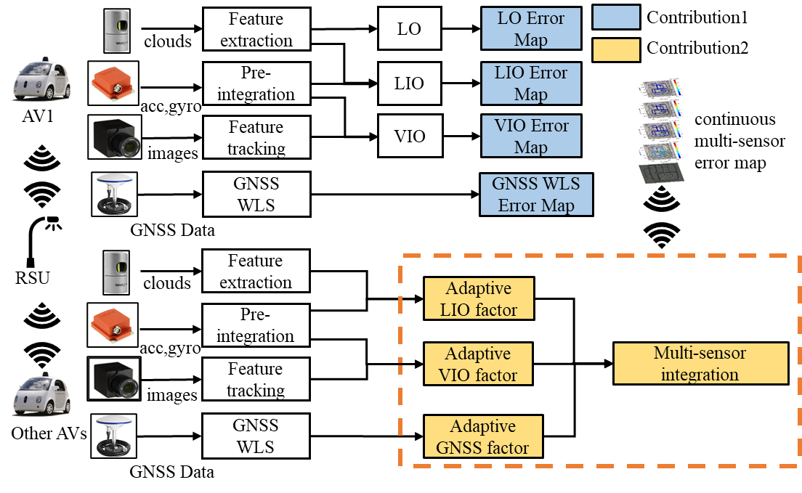
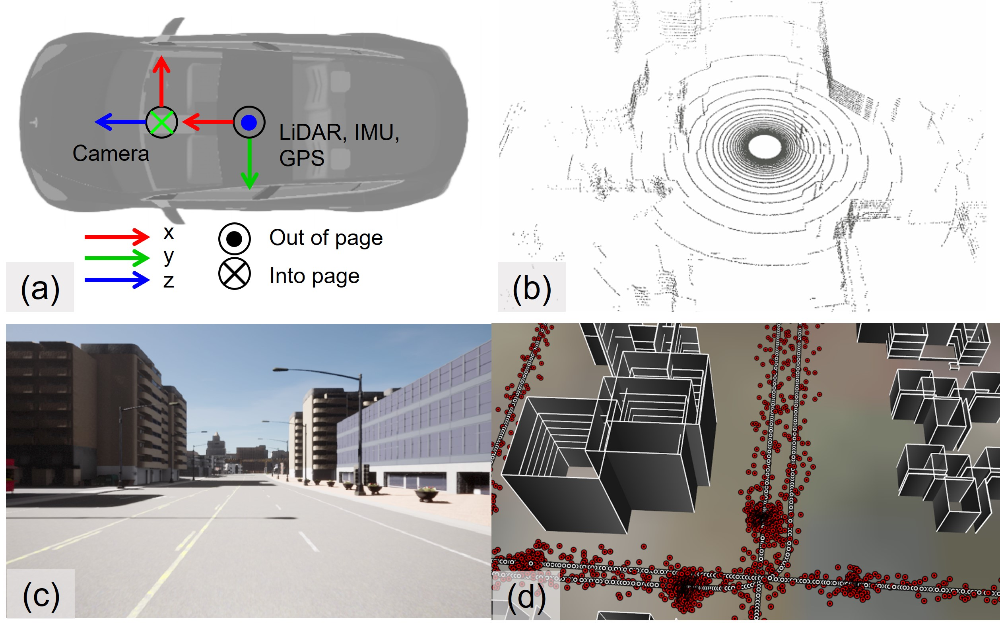

# Continuous Error Map for Autonomous Vehicles in Urban Areas

This repo will contain the implementation for our ITSC 2023 [paper](https://ieeexplore.ieee.org/abstract/document/10422216): **Adaptive Multi-Sensor Integrated Navigation System Aided by Continuous Error Map from RSU for Autonomous Vehicles in Urban Areas**. It is part of the project [V2X Cooperative Navigation](https://sites.google.com/view/v2x-cooperative-navigation).

<p align="center">
  
</p>

## Videos:
Checkout our demo at [Video Link](https://youtu.be/6iRHJKm1LQc)
<p align='center'>
<a href="https://youtu.be/6iRHJKm1LQc">

</a>
</p>

## Sensor Setup
<p align="center">
  
</p>

We collect 10 Hz LiDAR point cloud, 20 Hz images, 100 Hz IMU and 100 Hz ground truth positioning that explicitly considers the real-world noise in urban scenarios under a maximum speed of 30 km/h. Furthermore, we simulated the GNSS measurements using the realist [RUMS simulator](https://www.mdpi.com/2072-4292/13/4/544), which considers the impact of signal reflection and diffraction based on the 3D building model, as the CARLA can only simulate GNSS solutions with Gaussian noise. You can also collect your data using the tools [here](tools/data_collection/)

| Sensor | Description 
| :-----:| :---------: |
| 1x LiDAR| 360° Horizontal FOV, +10°~-30° vertical FOV, 100 meters, Velodyne  HDL 32 noise model, 5cm standard deviation on range measurement |
| 1 x RGB Camera | FoV of 90°, 960x600, forward, default noise setting  in CARLA |
| 1 x IMU | 100 Hz, 9-axis, Xsens MTi 10  noise model according to [UrbanNav](https://github.com/IPNL-POLYU/UrbanNavDataset/blob/master/UrbanNav-HK-Medium-Urban-1/xsens_imu_param.yaml)  |
| 1 x GNSS | 10 Hz, Ublox M8T noise model with sign reflection from buildings |

## Data Details
The dataset is released as rosbag while the ground truth is released both in TUM format and the raw output from CARLA simulator using [CarlaFLCAV](https://github.com/SIAT-INVS/CarlaFLCAV/tree/main) 

| name | Description | size | link | 
| :--: | :------: | :--: | :--: |
| urban-noon 1 | simulation data to generate error maps at noon | 32.0 GB | [ROSBAG](https://www.dropbox.com/s/b10qu69u687y5ew/urban_noon1.bag?dl=0), [GT](https://www.dropbox.com/sh/yvcm7ghgopwi8lz/AAAXSX4OnxpDJqFc80crVESIa?dl=0)|
| urban-noon 2  | test data for error map-aided sensor fusion at noon | 32.0 GB | [ROSBAG](https://www.dropbox.com/s/j0l1bbdd0ggv9xl/urban_noon2.bag?dl=0), [GT](https://www.dropbox.com/sh/5z6ccum6m2otzkt/AAD4UqZu3cPllKoZDqVbWYJGa?dl=0)|
| urban-sunset 1 | simulation data to generate error maps at sunset | 32.0 GB | [ROSBAG](https://www.dropbox.com/s/2psupapj1dez5t0/urban_sunset1.bag?dl=0), [GT](https://www.dropbox.com/sh/z3nyw17kungqg0c/AABJICVk7dVCiIgVvBbeWcHma?dl=0)|
| urban-sunset 2 | test data for error map-aided sensor fusion at sunset | 32.0 GB | [ROSBAG](https://www.dropbox.com/s/xwc3f2gjiu578lo/urban_sunset2.bag?dl=0), [GT](https://www.dropbox.com/sh/iltcx0v2wcfq5q7/AAA4LcpPqsq5CzZixVxDoPTea?dl=0)|
| urban-night 1 | simulation data to generate error maps at sunset | 32.6 GB | [ROSBAG](https://www.dropbox.com/s/de0thg12x7f9t9r/urban_night1.bag?dl=0), [GT](https://www.dropbox.com/sh/o3np2xhastx1wgj/AABTEHnu2vM1U6WsFQjHPSKua?dl=0)|
| urban-night 2 | test data for error map-aided sensor fusion at sunset | 32.0 GB | [ROSBAG](https://www.dropbox.com/s/fyv1hb0id185zos/urban_night2.bag?dl=0), [GT](https://www.dropbox.com/sh/mewsq9rsgo4sjav/AAC90QmhBPg6n24KncRgrYiya?dl=0)|

The topics within the rosbag are listed below:
| topic | type | frequency | description |
| :---: | :--: | :-------: | :---------: |
| /carla/ego_vehicle/lidar | sensor_msgs/PointCloud2 | 10Hz | 32 line LiDAR |
| /carla/ego_vehicle/image | sensor_msgs/Image | 20Hz | FoV of 90° 960x600 image |
| /carla/ego_vehicle/gnss      | nav_msgs/Odometry | 10Hz | GNSS data |
| /carla/ego_vehicle/gnss_path | nav_msgs/Path   | 10Hz | GNSS path, for vis use |
| /carla/ego_vehicle/gt_path   |nav_msgs/Path  | 10Hz | GT path, for vis use |
| /carla/ego_vehicle/imu   | sensor_msgs/Imu   | 100Hz | IMU data |

## Run

### Error map estimation
You can refer the [config](https://github.com/DarrenWong/continuous_error_map/tree/main/config) folder of the sensor parameter for running LOAM, LIOSAM, VINS and LVISAM with this data

### Error-map-aided multi-sensor fusion
We are arranging the code, which will come soon!!

## Acknowledge
We acknowledge the [CarlaFLCAV](https://github.com/SIAT-INVS/CarlaFLCAV/tree/main) for the useful tools to collect the data in CARLA. The authors also thank the valuable comments from ITSC 2023 reviewer, we will include the speed profile in the future.

## Citation
If you use this work for your research, you may want to cite
```
@INPROCEEDINGS{rsalio2023huang,
  author={Huang, Feng and Wen, Weisong and Zhang, Guohao and Su, Dongzhe and Hsu, Li-Ta},
  booktitle={2023 IEEE 26th International Conference on Intelligent Transportation Systems (ITSC)}, 
  title={Adaptive Multi-Sensor Integrated Navigation System Aided by Continuous Error Map from RSU for Autonomous Vehicles in Urban Areas
}, 
  year={2023},
  volume={},
  number={}
}
