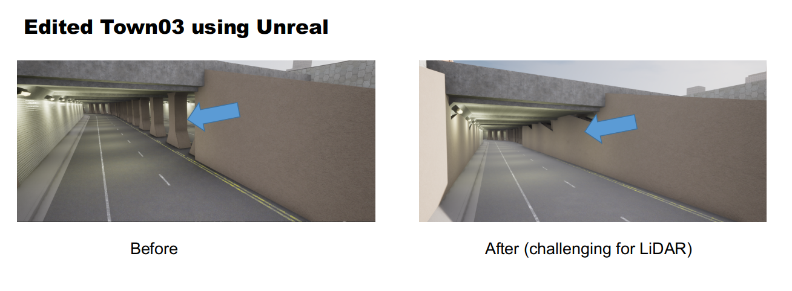

# Data collection tools 

This tool is very useful to collect the data in the latest version of CARLA (tested on 0.9.14). It is modified based on the [**CarlaFLCAV**](https://github.com/SIAT-INVS/CarlaFLCAV). For installation, please refer to [this](https://github.com/SIAT-INVS/CarlaFLCAV/tree/main/FLDatasetTool)

Some new things compared to CarlaFLCAV:
1. add IMU collection , it is useful for SLAM usage
2. add route support, you need to specify the route in the [world_config](config/world_config_town03.json) according to the route point displayed in the [visualize_map](utils/visualize_map.py).


## Run
You need to replace the town03 map to the maps in the edited_map folder with your CARLA path __CarlaUE4/Content/Carla/Maps__(tested in carla_0.9.14, please remember to backup the original map) to make it challenging for LiDAR SLAM  
<p align="center">
  
</p>


```
python3 data_recorder.py -w world_config_town03.json
```

 Then the data is save in the raw_data folder. You can convert it into any format you want.
